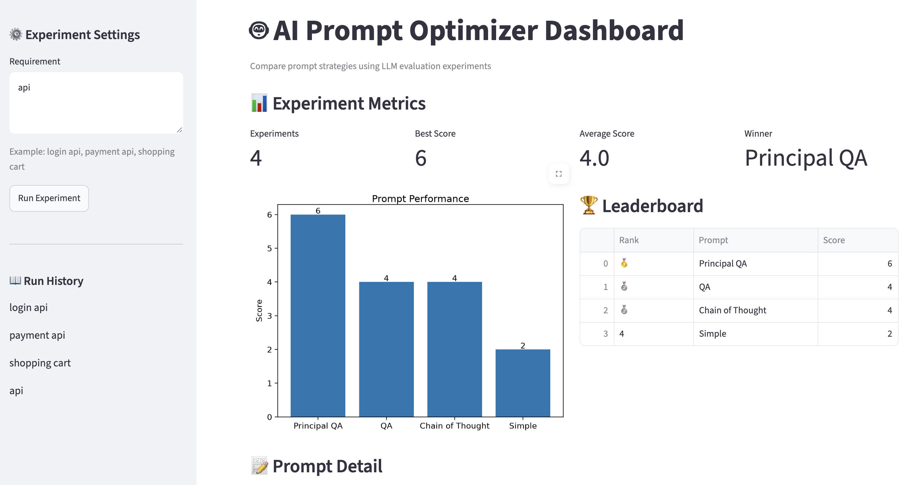

# 🤖 AI Prompt Optimization Platform

An end-to-end AI engineering project demonstrating prompt engineering, experiment tracking, evaluation, and dashboard visualization.


### 🚀 Live Demo

https://ai-test-generator.streamlit.app/

---

## 📸 Dashboard



---

# ✨ Features

- Prompt template generation
- Prompt mutation
- Prompt optimization
- Prompt A/B testing
- Experiment tracking
- Prompt quality evaluation
- Interactive Streamlit dashboard
- Modular architecture for future LLM integration

---

# 🏗 Architecture

```text
                 User Requirement
                        │
                        ▼
                Prompt Mutator
                        │
                        ▼
                  Fake LLM
                        │
                        ▼
              Quality Evaluator
                        │
                        ▼
             Experiment Tracker
                        │
                        ▼
              Prompt Optimizer
                        │
                        ▼
             Streamlit Dashboard
```

## Components

| Module | Responsibility |
|----------|---------------|
| PromptMutator | Generate multiple prompt templates |
| FakeLLM | Simulate LLM responses without API cost |
| QualityEvaluator | Evaluate generated test cases |
| ExperimentTracker | Record experiment history |
| PromptOptimizer | Coordinate the optimization workflow |
| Dashboard | Visualize experiment results |

---

# 🚀 Project Evolution

This project was intentionally developed in multiple phases to simulate how an AI engineering project evolves in production.

| Phase | Milestone |
|---------|-----------|
| Phase 1 | Mock Test Generator |
| Phase 2 | Prompt Builder |
| Phase 3 | Fake LLM Integration |
| Phase 4 | Prompt Optimizer |
| Phase 5 | Experiment Tracker |
| Phase 6 | Dashboard Visualization |
| Phase 7 | Deployment & Documentation |

---

# 📂 Repository Structure

```text
src/

├── dashboard/
│   ├── app.py
│   ├── chart.py
│   ├── leaderboard.py
│   ├── metrics.py
│   └── prompt_viewer.py

├── evaluator/
│   └── quality_evaluator.py

├── generator/
│   ├── fake_llm.py
│   └── base_llm.py

├── service/
│   ├── prompt_optimizer.py
│   ├── prompt_mutator.py
│   └── experiment_tracker.py
```

---

# ⚙️ How It Works

The optimization workflow follows these steps:

1. Enter a software requirement.
2. Generate multiple prompt candidates.
3. Run each prompt through the Fake LLM.
4. Evaluate generated test cases.
5. Track experiment results.
6. Rank prompts by score.
7. Visualize results using the Streamlit dashboard.

Workflow:

```text
Requirement
      │
      ▼
Generate Prompt Variants
      │
      ▼
Run Fake LLM
      │
      ▼
Evaluate Quality
      │
      ▼
Track Experiments
      │
      ▼
Rank Prompts
      │
      ▼
Dashboard
```

---

# ▶️ Run Locally

Clone the repository

```bash
git clone https://github.com/LizChenTX/ai-test-generator.git

cd ai-test-generator
```

Install dependencies

```bash
pip install -r requirements.txt
```

Run the optimizer

```bash
python -m src.main_optimizer
```

Launch the dashboard

```bash
streamlit run src/dashboard/app.py
```

---

# 📊 Dashboard

The dashboard provides:

- Experiment metrics
- Prompt leaderboard
- Prompt detail viewer
- Prompt comparison chart


---

# 🔮 Future Work

- OpenAI / Claude integration
- Token and cost tracking
- Multi-model comparison
- Persistent experiment history
- Prompt version management
- CI/CD pipeline
- Streamlit Cloud deployment

---

# 📄 License

MIT License